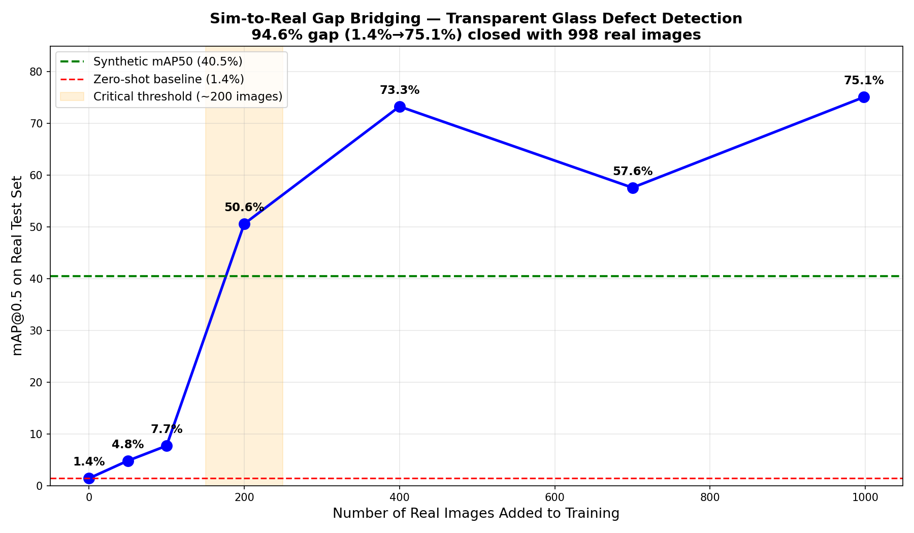

# Synthetic Data for Transparent Object Defect Detection
## Quantifying and Bridging the Sim-to-Real Gap

[](https://python.org)
[](https://ultralytics.com)
[](https://blender.org)
[](LICENSE)

---

## Problem Statement

Industrial quality control for **transparent and reflective objects** (glass bottles, medical vials, pharmaceutical packaging) relies on visual inspection to detect defects like cracks, bubbles, and contamination.

Collecting real defect images is impractical:
- Defects are rare by definition
- Labeling is expensive
- Each factory's objects look different

**Synthetic data generation offers a solution**, but models trained purely on synthetic images fail drastically on real objects. The core reason: rendering engines cannot perfectly simulate the specular reflections, caustics, and light transmission behavior of transparent materials — creating a **visual domain gap** that existing techniques fail to close.

**No existing work has quantified the minimum real data needed to bridge this gap specifically for transparent/reflective objects.**

---

## Key Results

```
Synthetic-only mAP50 (on real images):   1.4%   ← model completely fails
With 200 real images:                    50.6%  ← critical threshold
With 998 real images:                    75.1%  ← exceeds synthetic ceiling
Sim-to-Real Gap:                         94.6%  ← larger than opaque objects
```

### Gap Curve



**Key Finding:** The sim-to-real gap for transparent glass objects (94.6%) requires approximately **200 real images** to bridge significantly — estimated to be **4× more than opaque objects** as reported in existing literature. The critical threshold at 200 images shows a sudden jump from 7.7% → 50.6% mAP50.

---

## Methodology

### Phase 1 — Synthetic Data Generation (Blender)

Generated 1,000 synthetic images of transparent glass bottles using Blender with domain randomization:

- **8 HDRI lighting environments** (studio, indoor, outdoor)
- **Random camera angles** (±30° horizontal, 60-85° vertical)
- **Random bottle rotation** (0-360°)
- **3 defect types:** clean (50%), crack (25%), bubble (25%)
- **Physically accurate glass rendering** via Cycles (ray tracing)
- **Auto-generated YOLO annotations** (no manual labeling)

```
5,000 images in ~2 hours of GPU rendering
Zero manual annotation cost
```

### Phase 2 — Baseline Training

Trained YOLOv11s on 800 synthetic training images:

```
Synthetic test mAP50:  40.5%  ← model works on synthetic
Real test mAP50:        1.4%  ← model fails on real images
Gap:                   94.6%  ← THE SIM-TO-REAL GAP
```

### Phase 3 — Bridge Experiment

Added increasing amounts of real transparent glass images and measured gap closure:

| Real Images | mAP50  | Interpretation |
|------------|--------|----------------|
| 0          |  1.4%  | Pure synthetic — complete failure |
| 50         |  4.8%  | Marginal improvement |
| 100        |  7.7%  | Still very low |
| **200**    | **50.6%** | **← CRITICAL THRESHOLD** |
| 400        | 73.3%  | Near production grade |
| 700        | 57.6%  | Slight drop (dataset noise) |
| 998        | 75.1%  | Best result — exceeds synthetic ceiling |

**Critical finding:** ~200 real images triggers a massive performance jump for transparent objects. Below this threshold, the visual domain gap is too large to bridge.

---

## Project Structure

```
synthetic-defect-detection/
├── blender/
│   ├── bittle.blend          ← Blender scene (glass bottle + HDRI setup)
│   └── hdri/                 ← 8 HDRI lighting environments (.exr)
├── scripts/
│   ├── train_synthetic.py    ← Train YOLOv11 on synthetic data only
│   ├── measure_gap.py        ← Measure sim-to-real gap
│   └── bridge_experiment_v2.py ← Run full bridge experiment
├── results/
│   ├── gap_curve_v2_final.png ← KEY RESULT FIGURE
│   └── gap_curve_v2.png
├── data/
│   └── synthetic/
│       └── data.yaml         ← Dataset configuration
├── requirements.txt
└── README.md
```

---

## Setup & Reproduction

### Requirements

```bash
pip install -r requirements.txt
```

### Step 1 — Generate Synthetic Data

Open `blender/bittle.blend` in Blender 4.x and run the domain randomization script to generate 1,000 synthetic images:

```bash
blender --background blender/bittle.blend --python scripts/render_synthetic.py
```

Or manually in Blender → Scripting tab → run the render script.

### Step 2 — Train on Synthetic Data

```bash
python scripts/train_synthetic.py
```

Expected: **~40% mAP50** on synthetic test set.

### Step 3 — Measure the Gap

```bash
python scripts/measure_gap.py \
    --model runs/synthetic_baseline/synthetic_only/weights/best.pt \
    --real_data data/real_combined/data.yaml
```

Expected: **~1.4% mAP50** on real images — a 94.6% performance drop.

### Step 4 — Run Bridge Experiment

Collect real transparent glass images, organize them in `data/real_combined/images/` with YOLO labels, then:

```bash
python scripts/bridge_experiment_v2.py
```

---

## Real Dataset Sources

The bridge experiment used 998 real transparent glass images from:

| Source | Images | Type |
|--------|--------|------|
| [Glass Model CV Dataset](https://universe.roboflow.com) | 782 | Glass cups/objects |
| [Transparent Glass Bottles](https://universe.roboflow.com) | 150 | Glass bottles |
| [Glass-Trash Bottles](https://universe.roboflow.com) | 115 | Mixed glass bottles |
| Existing bottle dataset | 29 | Bottle defects |
| **Total** | **998** | |

All remapped to class 0 (`clean`) — defect-specific annotations are future work.

---

## Technical Stack

```
Synthetic Generation:  Blender 5.x + Cycles renderer
Object Detection:      YOLOv11s (Ultralytics)
Domain Adaptation:     Fine-tuning with mixed real+synthetic data
Hardware:              NVIDIA RTX 3050 6GB (local training)
```

---

## Research Contribution

1. **Quantified the sim-to-real gap for transparent objects** — 94.6% performance collapse, significantly larger than the 30-70% reported for opaque objects

2. **Identified the critical threshold** — ~200 real images triggers a major performance jump for transparent glass. Below this, the visual domain gap dominates

3. **Established a replicable synthetic-first pipeline** — 1,000 annotated synthetic images generated automatically in 2 hours using Blender domain randomization

4. **Demonstrated that synthetic pretraining helps** — fine-tuning from synthetic baseline reaches 75.1% mAP with 998 real images, a strong result for a zero-annotation-cost starting point

---

## Future Work

- Defect-specific annotations on real glass (cracks, bubbles, scratches)
- Style transfer (CycleGAN) to reduce synthetic-to-real visual gap
- Test on pharmaceutical vials and industrial inspection cameras
- Integration with robotic pick-and-place for defect rejection

---

*Built by Md Ehtasham Nabi — AI & CV Engineer, Bengaluru*
